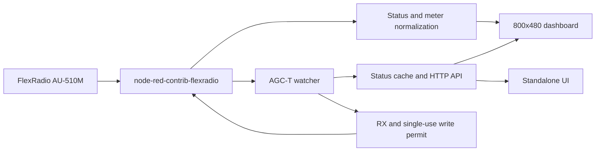

# Architecture

Root flows.json contains 82 nodes and five tabs: disabled rfpower-watt, disabled
and enabled manual meter-list tabs, enabled 35-meter dashboard, enabled watcher.
Historical TEST/EXPERIMENT names do not make live paths disposable. Four ui-template
nodes implement PA/TX/RX/EXT; the PA template also owns RADIO and AGC-T. Browser
navigation events synchronize all mounted widgets.

The backend resolves numeric meter IDs from inventory and preserves source units.
FWDPWR/REFPWR dBm convert to watts with `10 ** ((dBm - 30) / 10)`. Status merges
partial slice updates, selects the unique active slice and uses interlock for
RX/TX. Display averaging does not feed the watcher's raw measurements.

Watcher routes: GET /agct-watcher, GET /agct-watcher/status,
POST /agct-watcher/control. Settings controls are same-origin checked and write
agct-watcher-settings.json by atomic rename. Context is memory-only; Auto defaults
OFF. Credential material remains owned by Node-RED.

## Deployment contracts retained

- Host: http://dietpi.fritz.box:1880, Dashboard base /dashboard.
- Radio config 7fbf2bfc9badc7d3 uses automatic discovery; blank host/port.
- FRStack RFPOWER: http://192.168.178.27:5025/Radio/RFPOWER.
- FRStack meters: ws://127.0.0.1:5025/ws/meters on host;
  ws://dietpi.fritz.box:5025/ws/meters from Windows.
- Historical routes: /rfpower-watt, /rfpower-step, /rfpower-icon, /rfpower-plugin,
  /rfpower-mainfan. Only /rfpower-watt exists in today's export and its tab is
  disabled. Do not claim all historical routes are live.
- Stream Deck SDK 2 / embedded Node 20; Windows 10+ / Stream Deck 6.4+;
  N1MM RadioInfo uses Windows loopback UDP 127.0.0.1:12060.
- RFPOWER math, plugin UUIDs, assets and absolute runtime paths remain unchanged.
- Unused MQTT and radio/WebSocket configs remain for compatibility.

No new GPIO, tuning, RF-power, antenna or ATU assumptions were introduced.

Root flows.json remains authoritative. flows/dashboard.json is a dependency-closed
copy with its tab disabled. flows/agct-watcher.json mirrors the disabled example
and reuses the shared radio config. Exporting does not deploy. Historical migration
scripts must not be replayed over the current UI.
