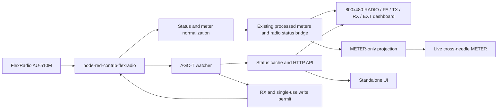

# Architecture

```mermaid
flowchart LR
 R[FlexRadio AU-510M] --> F[node-red-contrib-flexradio]
 F --> N[Status and meter normalization]
 N --> B[Existing processed meters and radio status bridge]
 B --> D[800x480 RADIO / PA / TX / RX / EXT dashboard]
 B --> P[METER-only projection]
 P --> M[Live cross-needle METER]
 F --> W[AGC-T watcher]
 W --> S[Status cache and HTTP API]
 S --> D
 S --> U[Standalone UI]
 W --> G[RX and single-use write permit]
 G --> F
```

Root flows.json contains 84 nodes and five tabs: disabled rfpower-watt, disabled
and enabled manual meter-list tabs, enabled 35-meter dashboard, enabled watcher.
Historical TEST/EXPERIMENT names do not make live paths disposable. Five ui-template
nodes implement PA/TX/RX/EXT and METER; the PA template also owns RADIO and AGC-T.
Browser navigation events synchronize all mounted widgets. METER is an additional
consumer of the existing processed values, not an intermediate RADIO/PA path.

The backend resolves numeric meter IDs from inventory and preserves source units.
FWDPWR/REFPWR dBm convert to watts with `10 ** ((dBm - 30) / 10)`. Status merges
partial slice updates, selects the unique active slice and uses interlock for
RX/TX. Each dBm power sample converts to Watts before Watt averaging. Display
averaging does not feed the watcher's raw measurements. The METER projection
retains the historical ID `au510m_meter_forward_only` and forwards live FWDPWR,
REFPWR, SWR and normalized TX/RX to `au510m_power_swr_static_ui`. It owns the
one shared 20/200/2000 W range selector. See [meter geometry](cross-needle-meter.md).

Watcher routes: GET /agct-watcher, GET /agct-watcher/status,
POST /agct-watcher/control. Settings controls are same-origin checked and write
agct-watcher-settings.json by atomic rename. Context is memory-only; Auto defaults
OFF. Credential material remains owned by Node-RED.

## Deployment contracts retained

- Host: http://dietpi.fritz.box:1880, Dashboard base /dashboard.
- Radio config 7fbf2bfc9badc7d3 uses automatic discovery; blank host/port.
- FRStack RFPOWER: http://192.168.178.27:5025/Radio/RFPOWER.
- FRStack meters: ws://127.0.0.1:5025/ws/meters on host;
  ws://dietpi.fritz.box:5025/ws/meters from Windows.
- Historical routes: /rfpower-watt, /rfpower-step, /rfpower-icon, /rfpower-plugin,
  /rfpower-mainfan. Only /rfpower-watt exists in today's export and its tab is
  disabled. Do not claim all historical routes are live.
- Stream Deck SDK 2 / embedded Node 20; Windows 10+ / Stream Deck 6.4+;
  N1MM RadioInfo uses Windows loopback UDP 127.0.0.1:12060.
- RFPOWER math, plugin UUIDs, assets and absolute runtime paths remain unchanged.
- Unused MQTT and radio/WebSocket configs remain for compatibility.

No new GPIO, tuning, RF-power, antenna or ATU assumptions were introduced.

Root flows.json remains authoritative. flows/dashboard.json is a dependency-closed
copy with its tab disabled. flows/agct-watcher.json mirrors the disabled example
and reuses the shared radio config. Exporting does not deploy. Historical migration
scripts must not be replayed over the current UI.

The current deployed snapshot and validation limits are recorded in the
[v4.21 handoff](handoff-2026-10-04-v4.21.md). Runtime version values are maintained
only in agct-watcher-version.json and published by watcher status.

## AU-510M passive diagnostic Stage 1 (v4.22)

Stage 1 is implemented as an isolated, RAM-only observer. The [implementation
and acceptance report](au510m-stage1-v4.22.md) lists exact sources and limitations.
The existing 84 nodes, connection, parser, subscriptions and UI paths remain
unchanged apart from the central watcher version environment. Three diagnostic
nodes add one tab, one observer Function and one disabled isolated Debug output;
there is no DIAG dashboard page.

The event lane retains relevant changes and separate existing requests/ACKs.
The health lane samples eleven already processed canonical meters at 1 Hz RX,
5 Hz canonical TX or a fresh active TUNE candidate. Raw meter events are never
retained and Watts are never converted again. The ring uses monotonic age:
240 seconds AND 12000 records, with counted age/count/memory evictions and
bounded metadata. The measured sizing basis is in the [two-lane report](au510m-stage1-two-lanes-2026-10-07.md):
23 records/s × 240 s × 2 reserve = 11040, rounded to 12000; expected mixture
about 20 MiB, conservative estimated-record budget 50 MiB.

Interlock observations are DIRECT; TX/RX is copied from the canonical reducer,
with DERIVED_FROM_INTERLOCK and a source sequence. Sequence denotes local arrival
order, not guaranteed radio-internal causal order. Physical trigger and command
sender remain distinct; unavailable origin stays UNKNOWN. Ambiguous repeated
request message identifiers cannot prove an individual ACK correlation.

`transmit.payload.tune` remains a directly observed candidate, never promoted
to canonical TUNE. A configured 15-second monotonic freshness window is conservative:
current status refreshes were observed around 5 seconds, without a guaranteed
heartbeat contract. Missing updates expire to UNKNOWN. Startup/redeploy begins
with sequence 1 LOGGER_START and UNKNOWN state; disconnect resets latest state
and freshness while keeping history. Connection recovery only admits post-epoch
meter updates. A canonical-context Interlock baseline is explicitly labeled as
cached canonical context, not fabricated as a new wire event.

The [larger diagnostic plan](au510m-diag-analysis.md) remains future work:
no SQLite, incident detector, JSONL captures, diagnostic state machine or DIAG UI.
Next stage is a separately authorized diagnostic state machine.

## AU-510M diagnostic Stage 2 (v4.23)

The [state-machine specification and acceptance](au510m-stage2-v4.23.md) adds
one isolated record reducer to Stage 1. It consumes only Stage-1 records and
publishes compact DIAG_STATE_CHANGE records into the same bounded ring.
TUNE is a freshness-gated DIAGNOSTIC_TUNE_SIGNAL; state confidence DIRECT/DERIVED/
UNKNOWN remains separate from command-origin confidence. Exact observed PTT and
unkey states are supported; unsupported evidence stays UNKNOWN. Return-to-RX
settles immediately within one source-event reduction, without a timer. Existing
radio paths, health rates, subscriptions and dashboard templates remain unchanged.
No persistence, incident detector or DIAG page is added. Live RX/TX, retention and controlled TUNE acceptance pass; browser visual verification remains unavailable.

## Stage 3 v4.24 candidate — rolled back to v4.23

The authorized v4.24 deployment was rolled back at 18:11:51 on 7 October 2026
after canonical active slice disappearance; current runtime is v4.23. Acceptance,
commit and push are stopped. The later [natural episode](au510m-natural-oscillation-2026-10-07-1832.md)
is captured under v4.23 and detected by offline replay only.

The RAM-only TUNE_RX_OSCILLATION detector candidate consumes existing
diagnostic records and unchanged Stage-2 outputs. Three complete start-to-RX
cycles inside five seconds require fresh active TUNE at RX or observed reactivation
between cycles. A bounded ten-second lookup in the existing ring preserves direct
precursor faults separately from the first abnormal incident event. Deduplication,
PRE boundary references and original-trigger 120-second POST lifecycle stay in RAM.
No new radio path, subscription, parser, forensic buffer, incident writer, database
or DIAG dashboard. Existing 1/5-Hz Health and 240 s/12000 retention stay unchanged.
The known v4.23 UNKNOWN linkage gap is not refactored.
See [Stage-3 release and validation](au510m-stage3-v4.24.md) and the immutable
[natural evidence](measurements/au510m-natural-oscillation-2026-10-07.json).
The [earlier slice recovery report](au510m-slice-recovery-2026-10-07.md) describes
the historical preauthorization state. STOP FOR REVIEW after live acceptance.

## Current persistent incident logging — v4.27

The canonical implementation is [Stage 4 v4.27](au510m-stage4-v4.27.md).
SQLite uses the built-in Node.js 26.3.0 `node:sqlite` API exclusively in a worker.
The database is `data/au510m-diagnostics.sqlite`; sanitized per-incident JSONL files
are in `data/incidents/`. The complete data directory is excluded from Git.
WAL, synchronous=NORMAL, foreign keys and a 5000-ms busy timeout are enforced.
Only EVENT and HEALTH records inside incident windows are persisted; no raw
radio packet stream or continuous normal-history database is written.

The existing detector draft is now an authorized passive incident consumer.
The Stage-1 core, v4.23 state machine, 240-second/12000-record ring, 1/5-Hz
sampling and PA_FAULT v4.26 remain unchanged. PRE is 120 seconds; same-episode
qualifying cycles extend POST to the latest trigger +120 seconds. Independent
incidents may overlap. Missing coverage, disconnects and interrupted restarts
remain explicit; historical replay never fabricates its unavailable POST.

Event/health row retention is 30 days/48 hours, excluding COLLECTING incidents.
Metadata and sanitized JSONL are retained indefinitely. Positive field lists
exclude handles, sessions, raw sources, journal/process metadata and temporary
paths. SQLite failure degrades persistence only. No DIAG UI is added.
Older database paths, schema proposals and rollout notes below describe earlier
planning; the Stage-4 implementation is authoritative for current persistence.

## DIAG HISTORY incident export (v4.30)

The existing HISTORY view adds a compact EXPORT action for the selected incident.
An isolated SELECT-only SQLite worker writes four strictly allowlisted ZIP entries
under ignored `data/exports/`; fixed limits and incremental writing protect memory.
Known generated ZIPs download through random capability IDs with no filesystem
path parameter. Seven-day retention runs at startup/every six hours and does not
modify incident rows. LIVE, HISTORY reading, logger, radio connections,
subscriptions, health sampling and canonical meter pipelines are unchanged.
See [Stage 7 export and acceptance](au510m-stage7-v4.30.md) for fields, security,
file lifecycle, offline fixtures and actual kiosk acceptance status.
